<p align="center">
  
</p>

# EHR Form Standardization Platform

A deterministic, evidence-linked reference platform for making customized EHR form data
research-ready without pretending that heterogeneous clinical semantics are automatic.

[](#verification)
[](.python-version)
[](apps/web/package.json)
[](LICENSE)

> This bounded demonstration uses only synthetic/project-owned data. It is not an
> HDS-certified deployment, has not been validated against a private hospital schema, and
> makes no clinical-validity or universal-standardization claim.

## Demonstrated workflow

- Discover form definitions and calculate complete and mapping-compatibility fingerprints.
- Preserve `PRESENT`, explicit negative, unanswered, unknown, not applicable, hidden,
  corrected, voided, and deleted states without collapsing meaning.
- Resolve only released mappings in an exact, deterministic order.
- Require maker/checker review, test vectors, vocabulary binding, SHA-256 identity, and an
  Ed25519 signature before mapping publication.
- Quarantine version 4, approve its mapping, replay it, and create a new immutable research
  release without altering the prior release.
- Project eligible facts into an OMOP 5.4 subset while retaining separate release membership
  and source-to-fact lineage.
- Expose coverage, provenance, limitations, and site/period representativeness in a research
  catalog.
- Extract native document text first and run PaddleOCR locally only when needed, with evidence
  boxes, confidence thresholds, deterministic French rules, and abstention.
- Support central patient-level processing and site-local signed aggregate export with
  small-cell suppression.

## Guided application tour

These screenshots come from the reset synthetic scenario produced by `make screenshots`. The
Playwright capture checks every route at 1440×900 and 390×844, waits for the live API data, and
fails on horizontal viewport overflow. Desktop captures are shown below for readability; each
caption also links to the tested mobile layout.

The persona menu in the top-right changes the demo session and demonstrates role boundaries:

| Persona           | Demonstrated responsibility                                       |
| ----------------- | ----------------------------------------------------------------- |
| Engineer          | Inspect mappings, queue pipeline work, replay failures, run OCR   |
| Clinical steward  | Review test vectors, approve/sign mappings, run reviewed OCR      |
| Researcher        | Inspect releases, coverage, catalog metadata, and lineage         |
| Platform operator | Queue durable runs, replay quarantined work, inspect system state |

### 1. Command center — see the release posture


The landing page separates the live end-to-end release from the bounded scale harness. It reports
connected sites, released form versions, unresolved quarantine, published events, site-level usable
coverage, and the signature/vocabulary/drift gates that control publication. The lower panels guide
the version-4 drift resolution flow and show recent durable jobs and denominator-aware coverage.
[Open the mobile capture](docs/assets/generated/command-center-mobile.png).

### 2. Source explorer — inventory the input boundary

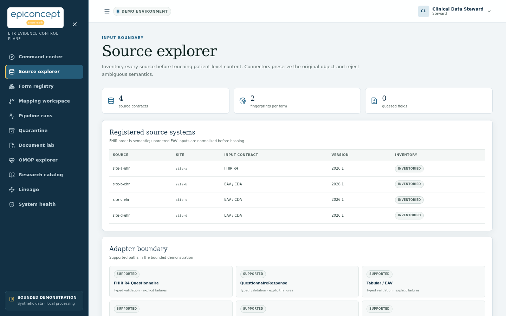

Every source is registered before patient-level processing. The inventory identifies the site,
input contract, version, and state, while the adapter boundary lists the explicitly supported FHIR
R4, QuestionnaireResponse, tabular/EAV, CDA, secure structured-data, and document paths. Inputs are
typed and rejected explicitly; fields are not guessed. [Open the mobile capture](docs/assets/generated/source-explorer-mobile.png).

### 3. Form registry — detect semantic drift

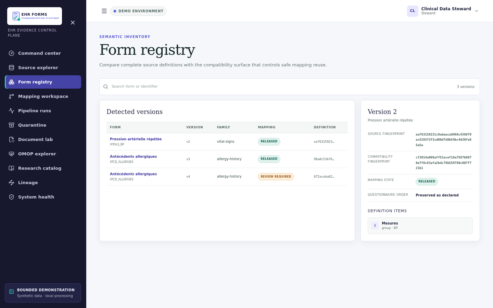

The registry compares form families and versions using two identities: a complete source
fingerprint for exact provenance and a compatibility fingerprint for safe mapping reuse. Selecting
a version exposes its full hashes, ordered definition items, and mapping status. In the opening
scenario, allergy version 4 is held for review because its value set changed.
[Open the mobile capture](docs/assets/generated/form-registry-mobile.png).

### 4. Mapping workspace — govern meaning with maker/checker review

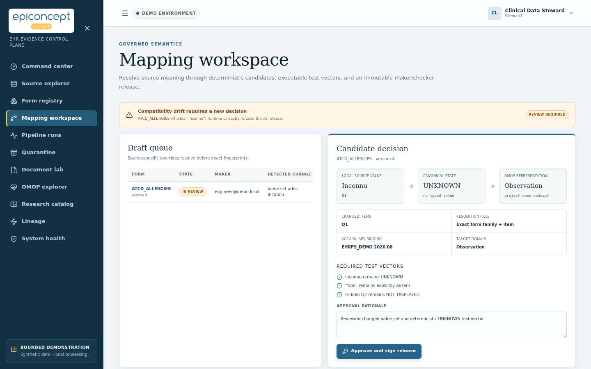

The draft explains the detected change and the exact transformation from local value `Inconnu` to
canonical `UNKNOWN` and then to its bound OMOP domain. Required test vectors protect unknown,
explicit-negative, and hidden states. Only the Clinical steward can record an approval rationale
and create the checksummed, Ed25519-signed immutable release; the application does not mutate Git.
[Open the mobile capture](docs/assets/generated/mapping-workspace-mobile.png).

### 5. Pipeline runs — inspect durable execution

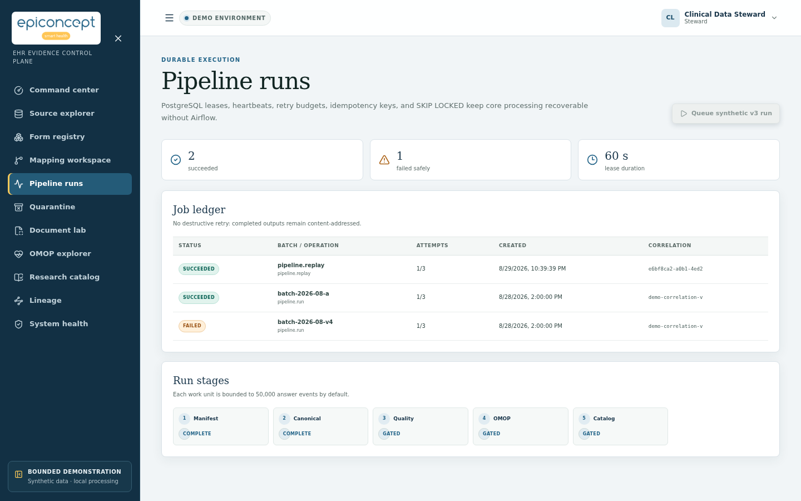

The job ledger makes attempts, retry budgets, creation time, and correlation identity visible. Core
work is leased from PostgreSQL with heartbeats and `SKIP LOCKED`, so it remains recoverable without
Airflow. Each work unit is bounded to 50,000 answer events and advances through manifest,
canonicalization, quality, OMOP, and catalog gates without destructively replacing completed
content-addressed outputs. [Open the mobile capture](docs/assets/generated/pipeline-runs-mobile.png).

### 6. Quarantine — preserve failures as evidence

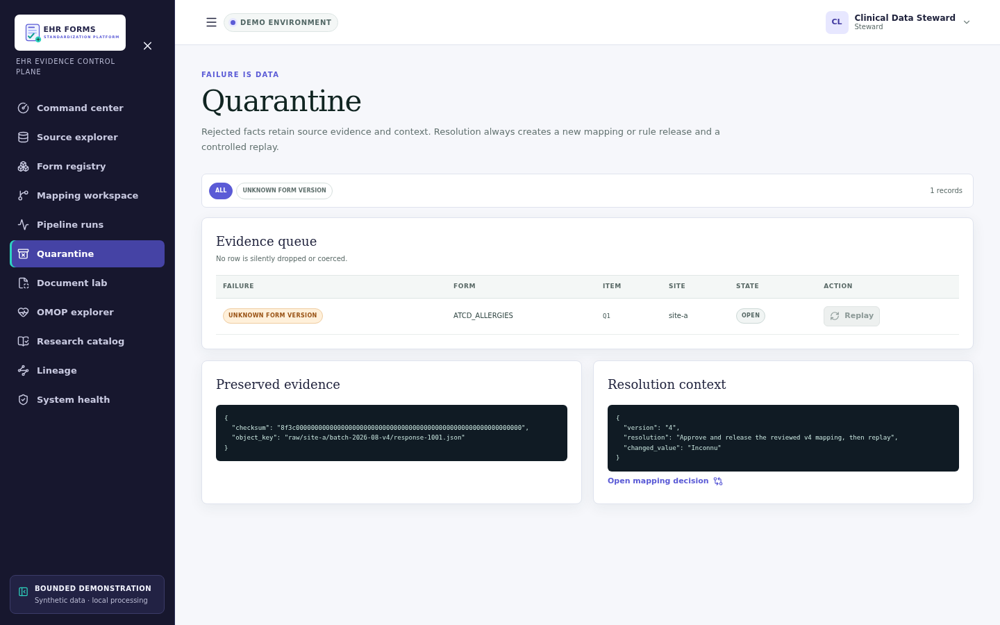

Rejected facts are retained rather than dropped or coerced. Filters expose the failure reason, and
the evidence/context panels keep the raw pointer, checksum, changed value, and required resolution
together. After a compatible mapping is released, an Engineer or Platform operator can queue a
controlled replay; the original failure and prior research release remain auditable.
[Open the mobile capture](docs/assets/generated/quarantine-mobile.png).

### 7. Document lab — keep OCR evidence reviewable

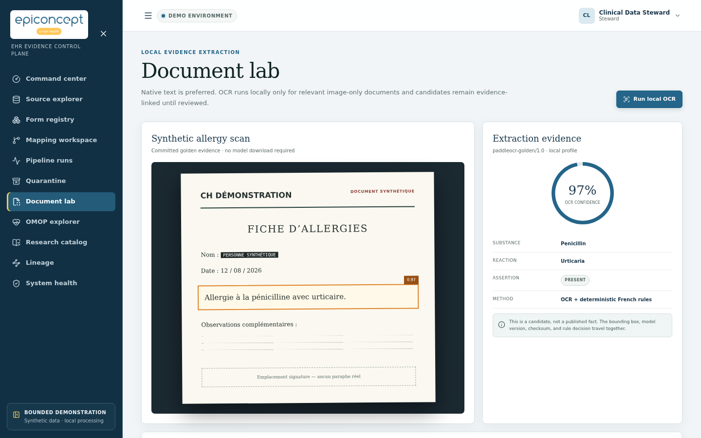

The document path prefers native text and invokes isolated local OCR only for relevant image-only
material. The screen keeps the detected bounding box, confidence, model version, checksum,
substance, reaction, and deterministic French assertion decision together. Extraction produces a
candidate—not a published clinical fact—and can abstain before human review.
[Open the mobile capture](docs/assets/generated/document-lab-mobile.png).

### 8. OMOP explorer — publish an immutable research projection

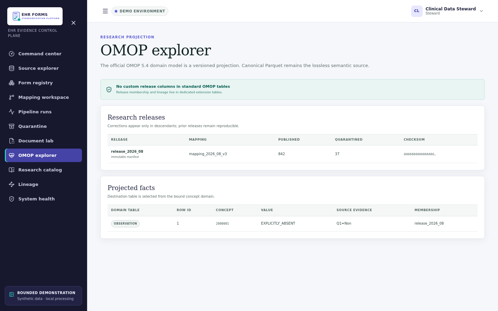

Canonical Parquet remains the lossless semantic source; OMOP 5.4 is a versioned research
projection. The release table exposes mapping identity, published/quarantined counts, and checksum,
while projected rows retain source evidence and release membership. Membership and lineage live in
extension tables, so standard OMOP tables receive no custom release columns.
[Open the mobile capture](docs/assets/generated/omop-explorer-mobile.png).

### 9. Research catalog — judge fitness for use

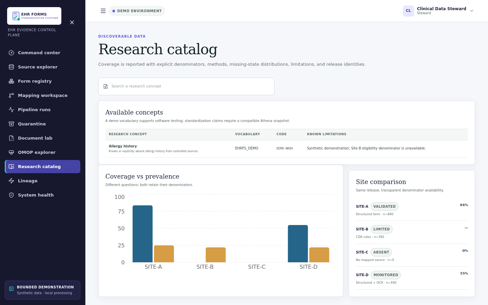

Researchers can search concepts and inspect definitions, vocabulary identity, codes, and known
limitations. Coverage and prevalence are shown as different measures with their own denominators,
methods, site/period scope, and quality status. The bundled vocabulary is for software testing;
clinical standardization requires a compatible licensed Athena snapshot.
[Open the mobile capture](docs/assets/generated/research-catalog-mobile.png).

### 10. Lineage — trace a result back to raw evidence

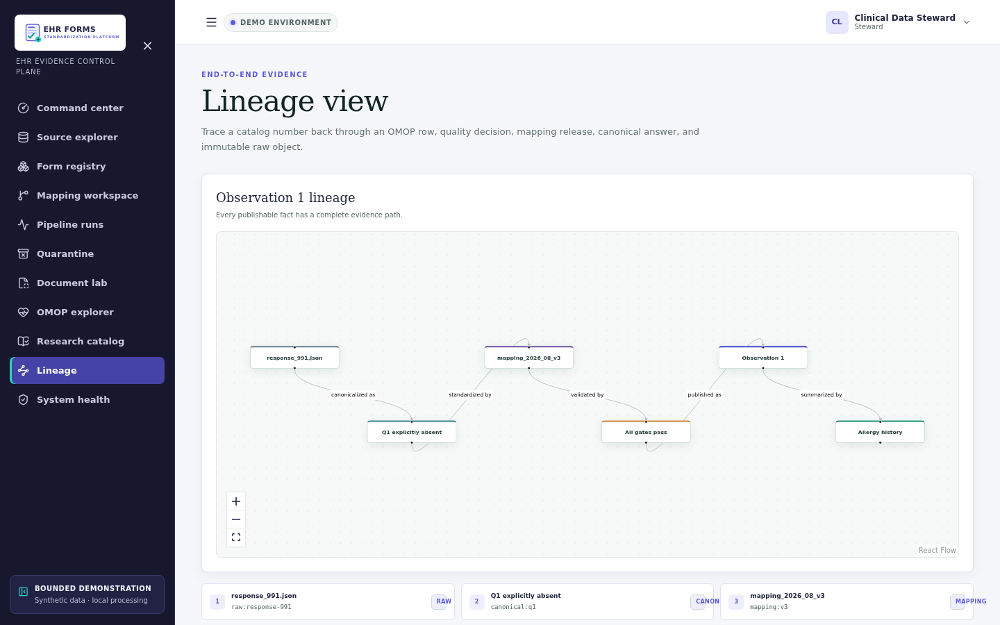

The interactive graph follows a catalog result backward through the OMOP observation, passed
quality gates, exact mapping release, canonical answer, and immutable raw response. The ledger below
the graph provides the same ordered identities without relying on the visualization alone.
[Open the mobile capture](docs/assets/generated/lineage-mobile.png).

### 11. System health — expose operational and audit evidence

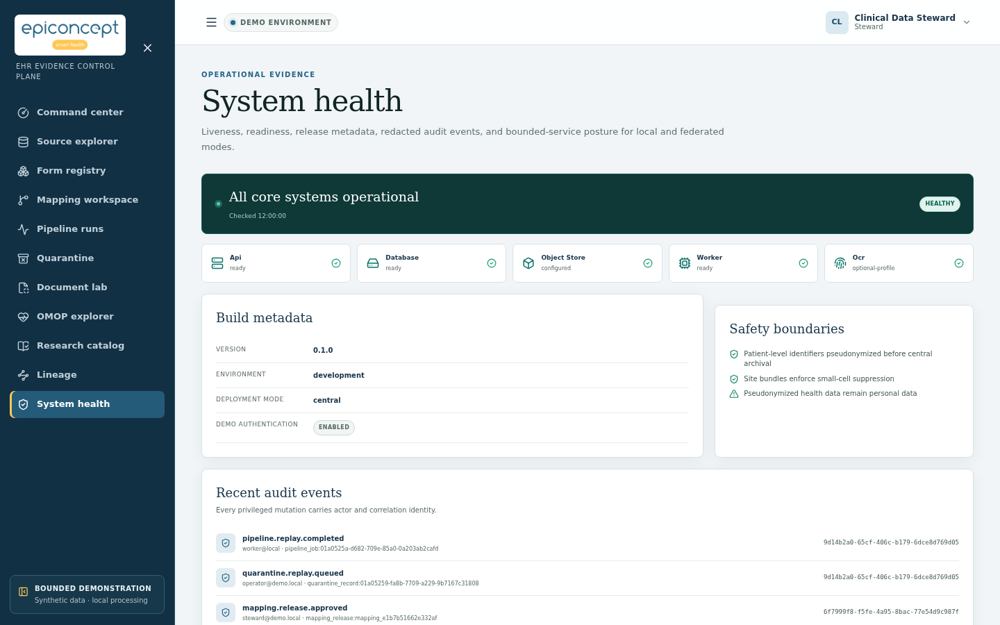

The final workspace combines liveness/readiness for the API, database, object store, worker, and
optional OCR profile with build/deployment metadata. It also states the bounded safety posture and
shows redacted privileged audit events with actor, resource, action, and correlation identity.
Health does not imply HDS certification, clinical validation, or production qualification.
[Open the mobile capture](docs/assets/generated/system-health-mobile.png).

## Architecture

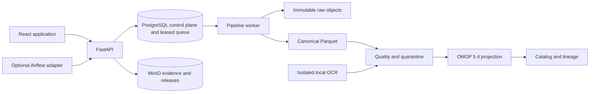

The Python modular monolith is deployed as separate API, worker, CLI, and optional scheduler
processes. PostgreSQL leases and `SKIP LOCKED` make core jobs durable without Airflow. Canonical
Parquet is the lossless semantic source; OMOP is an immutable research projection. Airflow calls
the same application boundary and contains no clinical business logic.

See [architecture](docs/architecture.md) and the [ADRs](docs/adr/).

## Quick start

Prerequisites: Docker with Compose, Node.js 24, pnpm 11, Python 3.12, and uv.

```bash
git clone <repository-url> ehr-form-standardization-platform
cd ehr-form-standardization-platform
cp .env.example .env
make showcase-up
```

`showcase-up` builds the complete CPU profile, waits for service readiness, and restores the
deterministic opening scenario. Open these local surfaces:

| Surface               | URL                                         | Started by                              |
| --------------------- | ------------------------------------------- | --------------------------------------- |
| Web application       | <http://localhost:3000>                     | `make up` or `make showcase-up`         |
| Offline API reference | <http://localhost:8000/docs>                | `make up` or `make showcase-up`         |
| Raw OpenAPI contract  | <http://localhost:8000/api/v1/openapi.json> | `make up` or `make showcase-up`         |
| Grafana               | <http://localhost:3001>                     | `make up-full` or `make showcase-up`    |
| Prometheus            | <http://localhost:9090>                     | `make up-full` or `make showcase-up`    |
| Airflow adapter       | <http://localhost:8088>                     | `make up-full` or `make showcase-up`    |
| MinIO console         | <http://localhost:9001>                     | `make up` or `make showcase-up`         |
| Local OCR health      | <http://localhost:8081/healthz>             | `make up-ocr-cpu` or `make showcase-up` |

The API reference uses only same-origin assets and therefore works without access to a public CDN.
The web personas are Engineer, Clinical steward, Researcher, and Platform operator; persona
switching exists only when `EHRFS_DEMO_MODE=true`. Demo-only credentials must remain in ignored
local files and must not be added to this public README.

Core startup is CPU-only and does not download an OCR model. Stop any local profile with
`make down`; volumes and evidence remain intact.

### Local operation commands

```bash
# Discover every supported command.
make help

# Start only PostgreSQL, MinIO, API, worker, and web.
make up

# Add Airflow, OpenTelemetry, Prometheus, and Grafana.
make up-full

# Add isolated local CPU OCR.
make up-ocr-cpu

# Start all of the above, wait for readiness, and reset the synthetic story.
make showcase-up

# Verify every browser-facing showcase service without modifying data.
make showcase-check

# Restore only the deterministic synthetic opening scenario.
make showcase-reset

# Follow the application processes; Ctrl-C stops following, not the containers.
make logs

# Inspect every container directly.
docker compose -f infra/compose/compose.yaml ps

# Stop containers without deleting data or named volumes.
make down
```

For live code development rather than containers, use `make api`, `make worker`, and `make web` in
separate terminals after configuring host-reachable PostgreSQL and MinIO URLs. `make seed` and
`make reset-demo` intentionally operate inside the running API container so Compose hostnames are
resolved correctly.

### Complete local showcase

To start the complete CPU demonstration, including Airflow, observability, local OCR, and a reset
of only the deterministic synthetic scenario:

```bash
make showcase-up
```

The launcher waits for and reports all eight browser-facing services. Recheck them at any time with
`make showcase-check`; restore the opening version-4 quarantine state with `make showcase-reset`.
The guided application tour above explains the complete browser workflow.

There are two deliberately separate proofs. The web application runs the complete raw → canonical
→ mapping → quality/quarantine → OMOP → catalog/lineage path. The scale harness measures bounded
canonical Parquet processing without pretending it is an end-to-end service benchmark:

```bash
make showcase-scale
SHOWCASE_EVENTS=100000000 make showcase-scale
```

The first command is a one-million-event validation run; the second reruns the reviewed
100-million-event proof. See
[ADR 0009](docs/adr/0009-scale-validation-and-bulk-orchestration.md) for the production bulk
coordinator and atomic publication design.

## Build and run reference

| Command                                      | Purpose                                                         |
| -------------------------------------------- | --------------------------------------------------------------- |
| `make install`                               | Verify and install both lockfiles                               |
| `make keys`                                  | Generate local Ed25519 keys with restrictive permissions        |
| `make api`, `make worker`, `make web`        | Run an individual development process                           |
| `make up`                                    | Build and start PostgreSQL, MinIO, API, worker, and web         |
| `make up-full`                               | Add Prometheus, Grafana, and the Airflow adapter                |
| `make up-ocr-cpu`                            | Add isolated CPU OCR on port 8081                               |
| `make up-ocr-gpu`                            | Add isolated NVIDIA OCR on port 8082                            |
| `make showcase-up`                           | Start, reset, and verify the complete CPU showcase stack        |
| `make showcase-check`                        | Check all eight browser-facing showcase services                |
| `make showcase-reset`                        | Restore the opening synthetic quarantine scenario               |
| `make showcase-scale`                        | Run a one-million-event bounded scale validation                |
| `make logs`                                  | Follow API, worker, and web logs                                |
| `make down`                                  | Stop services without deleting named volumes                    |
| `make seed`                                  | Idempotently seed the guided synthetic scenario                 |
| `make reset-demo`                            | Reset only demonstration rows                                   |
| `make ocr-smoke`                             | Run and measure the local CPU OCR fixture                       |
| `make full-profile-smoke`                    | Check Airflow and observability readiness                       |
| `make security-smoke`                        | Verify ClamAV clean and test-payload decisions                  |
| `make recovery-smoke`                        | Exercise checksummed backup and isolated restore                |
| `make screenshots`                           | Regenerate desktop/mobile route screenshots                     |
| `make docs`                                  | Rebuild OpenAPI, Mermaid SVGs, and the eight-page French PDF    |
| `make openapi`                               | Regenerate OpenAPI and TypeScript contracts                     |
| `make test`                                  | Run Python and frontend suites                                  |
| `make ci`                                    | Run the reproducible pull-request quality pipeline              |
| `make verify-all`                            | Run extended integration, E2E, OCR, recovery, and replay checks |
| `make clean-preview`                         | Preview generated paths eligible for removal                    |
| `CONFIRM=clean-generated make clean-confirm` | Remove only the previewed generated paths                       |

Python dependencies are managed only through uv; frontend dependencies are managed only through
pnpm. `uv.lock`, both OCR locks, and `pnpm-lock.yaml` are committed. Container bases are pinned by
digest. See [setup](docs/setup.md), [testing](docs/testing.md), and [operations](docs/operations.md).

## Profiles

- `core`: PostgreSQL 18, MinIO, FastAPI, leased worker, and React/Nginx. No OCR download.
- `full`: core plus Airflow, Prometheus, Grafana, and OpenTelemetry collection.
- `ocr-cpu`: lazy local PaddleOCR CPU inference using a persistent model volume.
- `ocr-gpu`: the same service contract with an explicitly locked CUDA 11.8 Paddle wheel.
- `security`: ClamAV; synthetic no-op scanning is never permitted outside explicit demo fixtures.

## Configuration

Every supported setting is documented inline in [.env.example](.env.example). Runtime settings
are validated on startup; placeholder secrets fail outside demo mode, heartbeats must be shorter
than leases, and the deployment mode is restricted to `central` or `site`.

| Variable                            | Default       | Meaning                                                       |
| ----------------------------------- | ------------- | ------------------------------------------------------------- |
| `EHRFS_DEPLOYMENT_MODE`             | `central`     | Patient-level central pipeline or site-local aggregate export |
| `EHRFS_DEMO_MODE`                   | `true`        | Enables seeded personas and generated-fixture conveniences    |
| `EHRFS_DATABASE_URL`                | Compose DSN   | PostgreSQL control, audit, queue, and OMOP schemas            |
| `EHRFS_PARTITION_ROWS`              | `50000`       | Maximum canonical answer events per work unit                 |
| `EHRFS_SMALL_CELL_THRESHOLD`        | `10`          | Suppression threshold for exported aggregate cells            |
| `EHRFS_OCR_ENDPOINT`                | local profile | Local-only OCR HTTP boundary                                  |
| `EHRFS_OTEL_EXPORTER_OTLP_ENDPOINT` | unset/Compose | Optional OTLP trace destination                               |

## API and CLI

All product resources live below `/api/v1`, use a stable problem-details error shape, return an
`X-Correlation-ID`, enforce RBAC, validate CSRF for cookie-authenticated mutations, and use cursor
pagination where collections are unbounded. The checked-in [OpenAPI contract](docs/api/openapi.json)
generates [the frontend types](apps/web/src/api/openapi-schema.ts).

The `ehrfs` CLI invokes the same services as the API and worker. Run `uv run ehrfs --help` or see
the [CLI reference](docs/api/cli.md).

## Data and terminology

Only small deterministic fixtures are committed. The 500-patient Synthea profile is generated in
a pinned container with fixed seeds; models, Athena vocabulary exports, and generated bulk data
remain ignored. Source URL, version, licence, settings, checksum, and transformation provenance
are recorded in the [data licence registry](docs/data/sources.md).

The bundled vocabulary is deliberately non-clinical. A demo may claim OMOP projection, but may
claim clinical standardization only after a compatible licensed Athena snapshot is loaded.

## Verification

`make ci` checks formatting, Ruff, strict mypy, ESLint, TypeScript, docs/PDF reproducibility,
Python coverage, frontend coverage, builds, dependency and secret audits, Semgrep, fail-closed
Trivy image scans, OpenAPI drift, and repository boundaries. Container CI emits SBOM and
provenance attestations. `make verify-all` adds the full observability/Airflow profile, ClamAV,
the complete browser flow at desktop and mobile sizes, deterministic replay, mutation testing,
OCR profiles, backup/restore, regenerated visual assets, and the recorded benchmark.

Coverage gates are 100% for critical semantic modules, at least 95% repository-wide Python, and
at least 90% frontend statements and branches. Benchmark results are measurements, not estimates;
see [benchmarks](docs/benchmarks/README.md).

## Security and legal posture

Pseudonymized health data remain personal data. A real French health-data warehouse may require
a CNIL declaration or authorization depending on purpose and legal basis, and production hosting
may fall within HDS obligations. This repository demonstrates controls; it does not claim CNIL
approval, HDS certification, legal compliance, or medical-device status.

Read [SECURITY.md](SECURITY.md), the [threat model](docs/security/threat-model.md), and
[limitations](docs/security/limitations.md) before adapting the code.

## Documentation

- [French eight-page case study](docs/case-study/ehr-form-standardization-case-study.fr.pdf)
- [Architecture and decisions](docs/architecture.md)
- [Setup and configuration](docs/setup.md)
- [API and CLI](docs/api/)
- [Operations and runbooks](docs/operations.md)
- [Testing and scenario matrix](docs/testing.md)
- [Contributing](CONTRIBUTING.md) and [security policy](SECURITY.md)

## Licence

Apache License 2.0. The EHR Form Standardization name and supplied logo remain the property of their respective
owner; the Apache licence does not grant trademark rights. See [LICENSE](LICENSE) and
[NOTICE](NOTICE).
