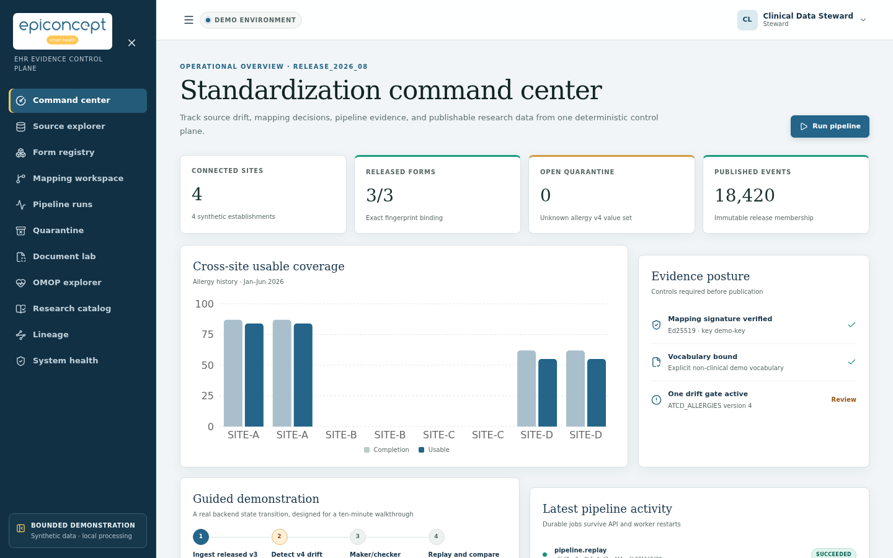
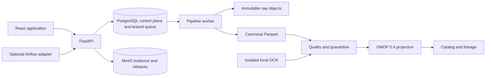

<p align="center">
  
</p>

# EHR Form Standardization Platform

A deterministic, evidence-linked reference platform for making customized EHR form data
research-ready without pretending that heterogeneous clinical semantics are automatic.

[](#verification)
[](.python-version)
[](apps/web/package.json)
[](LICENSE)



> This bounded demonstration uses only synthetic/project-owned data. It is not an
> HDS-certified deployment, has not been validated against a private hospital schema, and
> makes no clinical-validity or universal-standardization claim.

## Demonstrated workflow

- Discover form definitions and calculate complete and mapping-compatibility fingerprints.
- Preserve `PRESENT`, explicit negative, unanswered, unknown, not applicable, hidden,
  corrected, voided, and deleted states without collapsing meaning.
- Resolve only released mappings in an exact, deterministic order.
- Require maker/checker review, test vectors, vocabulary binding, SHA-256 identity, and an
  Ed25519 signature before mapping publication.
- Quarantine version 4, approve its mapping, replay it, and create a new immutable research
  release without altering the prior release.
- Project eligible facts into an OMOP 5.4 subset while retaining separate release membership
  and source-to-fact lineage.
- Expose coverage, provenance, limitations, and site/period representativeness in a research
  catalog.
- Extract native document text first and run PaddleOCR locally only when needed, with evidence
  boxes, confidence thresholds, deterministic French rules, and abstention.
- Support central patient-level processing and site-local signed aggregate export with
  small-cell suppression.

## Architecture



The Python modular monolith is deployed as separate API, worker, CLI, and optional scheduler
processes. PostgreSQL leases and `SKIP LOCKED` make core jobs durable without Airflow. Canonical
Parquet is the lossless semantic source; OMOP is an immutable research projection. Airflow calls
the same application boundary and contains no clinical business logic.

See [architecture](docs/architecture.md) and the [ADRs](docs/adr/).

## Quick start

Prerequisites: Docker with Compose, Node.js 24, pnpm 11, Python 3.12, and uv.

```bash
git clone <repository-url> ehr-form-standardization-platform
cd ehr-form-standardization-platform
cp .env.example .env
make up
```

Open <http://localhost:3000>. The API reference is at <http://localhost:8000/docs>, MinIO at
<http://localhost:9001>, and the seeded personas are Engineer, Clinical steward, Researcher,
and Platform operator. Persona switching exists only when `EHRFS_DEMO_MODE=true`.

Core startup is CPU-only and does not download an OCR model. Stop it with `make down`.

## Build and run reference

| Command | Purpose |
| --- | --- |
| `make install` | Verify and install both lockfiles |
| `make keys` | Generate local Ed25519 keys with restrictive permissions |
| `make api`, `make worker`, `make web` | Run an individual development process |
| `make up` | Build and start PostgreSQL, MinIO, API, worker, and web |
| `make up-full` | Add Prometheus, Grafana, and the Airflow adapter |
| `make up-ocr-cpu` | Add isolated CPU OCR on port 8081 |
| `make up-ocr-gpu` | Add isolated NVIDIA OCR on port 8082 |
| `make seed` | Idempotently seed the guided synthetic scenario |
| `make reset-demo` | Reset only demonstration rows |
| `make docs` | Rebuild OpenAPI, Mermaid SVGs, and the eight-page French PDF |
| `make openapi` | Regenerate OpenAPI and TypeScript contracts |
| `make test` | Run Python and frontend suites |
| `make ci` | Run the reproducible pull-request quality pipeline |
| `make verify-all` | Run extended integration, E2E, OCR, recovery, and replay checks |
| `make clean-preview` | Preview generated paths eligible for removal |
| `CONFIRM=clean-generated make clean-confirm` | Remove only the previewed generated paths |

Python dependencies are managed only through uv; frontend dependencies are managed only through
pnpm. `uv.lock`, both OCR locks, and `pnpm-lock.yaml` are committed. Container bases are pinned by
digest. See [setup](docs/setup.md), [testing](docs/testing.md), and [operations](docs/operations.md).

## Profiles

- `core`: PostgreSQL 18, MinIO, FastAPI, leased worker, and React/Nginx. No OCR download.
- `full`: core plus Airflow, Prometheus, Grafana, and OpenTelemetry collection.
- `ocr-cpu`: lazy local PaddleOCR CPU inference using a persistent model volume.
- `ocr-gpu`: the same service contract with an explicitly locked CUDA 11.8 Paddle wheel.
- `security`: ClamAV; synthetic no-op scanning is never permitted outside explicit demo fixtures.

## Configuration

Every supported setting is documented inline in [.env.example](.env.example). Runtime settings
are validated on startup; placeholder secrets fail outside demo mode, heartbeats must be shorter
than leases, and the deployment mode is restricted to `central` or `site`.

| Variable | Default | Meaning |
| --- | --- | --- |
| `EHRFS_DEPLOYMENT_MODE` | `central` | Patient-level central pipeline or site-local aggregate export |
| `EHRFS_DEMO_MODE` | `true` | Enables seeded personas and generated-fixture conveniences |
| `EHRFS_DATABASE_URL` | Compose DSN | PostgreSQL control, audit, queue, and OMOP schemas |
| `EHRFS_PARTITION_ROWS` | `50000` | Maximum canonical answer events per work unit |
| `EHRFS_SMALL_CELL_THRESHOLD` | `10` | Suppression threshold for exported aggregate cells |
| `EHRFS_OCR_ENDPOINT` | local profile | Local-only OCR HTTP boundary |
| `EHRFS_OTEL_EXPORTER_OTLP_ENDPOINT` | unset/Compose | Optional OTLP trace destination |

## API and CLI

All product resources live below `/api/v1`, use a stable problem-details error shape, return an
`X-Correlation-ID`, enforce RBAC, validate CSRF for cookie-authenticated mutations, and use cursor
pagination where collections are unbounded. The checked-in [OpenAPI contract](docs/api/openapi.json)
generates [the frontend types](apps/web/src/api/openapi-schema.ts).

The `ehrfs` CLI invokes the same services as the API and worker. Run `uv run ehrfs --help` or see
the [CLI reference](docs/api/cli.md).

## Data and terminology

Only small deterministic fixtures are committed. The 500-patient Synthea profile is generated in
a pinned container with fixed seeds; models, Athena vocabulary exports, and generated bulk data
remain ignored. Source URL, version, licence, settings, checksum, and transformation provenance
are recorded in the [data licence registry](docs/data/sources.md).

The bundled vocabulary is deliberately non-clinical. A demo may claim OMOP projection, but may
claim clinical standardization only after a compatible licensed Athena snapshot is loaded.

## Verification

`make ci` checks formatting, Ruff, strict mypy, ESLint, TypeScript, docs/PDF reproducibility,
Python coverage, frontend coverage, builds, dependency and secret audits, Semgrep, fail-closed
Trivy image scans, OpenAPI drift, and repository boundaries. Container CI emits SBOM and
provenance attestations. `make verify-all` adds the full observability/Airflow profile, ClamAV,
the complete browser flow at desktop and mobile sizes, deterministic replay, mutation testing,
OCR profiles, backup/restore, regenerated visual assets, and the recorded benchmark.

Coverage gates are 100% for critical semantic modules, at least 95% repository-wide Python, and
at least 90% frontend statements and branches. Benchmark results are measurements, not estimates;
see [benchmarks](docs/benchmarks/README.md).

## Security and legal posture

Pseudonymized health data remain personal data. A real French health-data warehouse may require
a CNIL declaration or authorization depending on purpose and legal basis, and production hosting
may fall within HDS obligations. This repository demonstrates controls; it does not claim CNIL
approval, HDS certification, legal compliance, or medical-device status.

Read [SECURITY.md](SECURITY.md), the [threat model](docs/security/threat-model.md), and
[limitations](docs/security/limitations.md) before adapting the code.

## Documentation

- [French eight-page case study](docs/case-study/ehr-form-standardization-case-study.fr.pdf)
- [Architecture and decisions](docs/architecture.md)
- [Setup and configuration](docs/setup.md)
- [API and CLI](docs/api/)
- [Operations and runbooks](docs/operations.md)
- [Testing and scenario matrix](docs/testing.md)
- [Interview demonstration guide](docs/interview-guide.md)
- [Contributing](CONTRIBUTING.md) and [security policy](SECURITY.md)

## Licence

Apache License 2.0. The EHR Form Standardization name and supplied logo remain the property of their respective
owner; the Apache licence does not grant trademark rights. See [LICENSE](LICENSE) and
[NOTICE](NOTICE).
